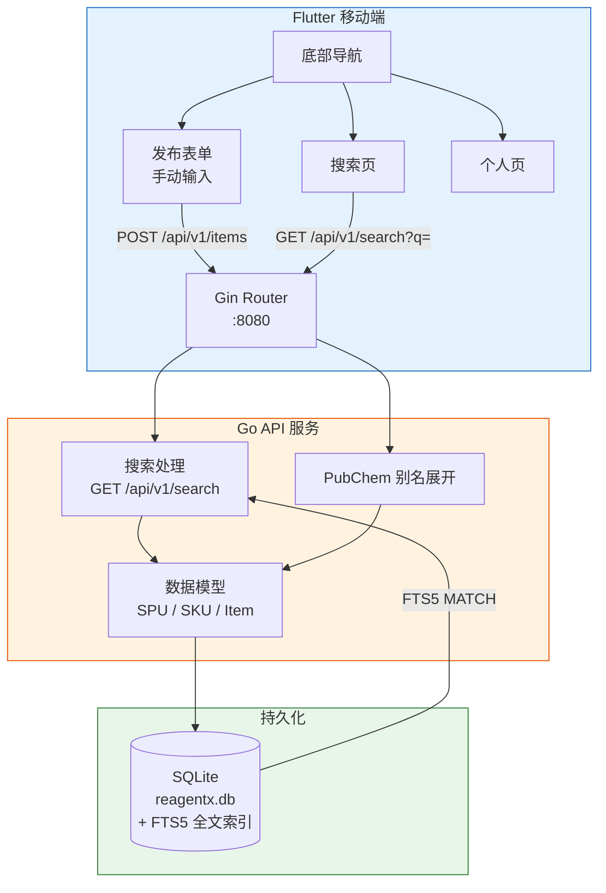

# ReagentX（试剂闲鱼）

去中心化的高校实验室闲置化学有机试剂共享/搜索平台。

## 架构



## 技术栈

| 层 | 技术 |
|----|------|
| 后端 | Go 1.21+ / Gin / SQLite（`modernc.org/sqlite`，纯 Go 无 cgo） |
| 前端 | Flutter 3.44+ / Dart 3.12+ / Provider / GoRouter |
| 搜索 | SQLite FTS5 + PubChem API 别名展开 + CAS 自动归并 |
| 输入方式 | 手动表单（语音识别 TODO） |

### 搜索原理

1. 发布时调 **PubChem API** 自动展开化学品别名（如 `EDTA` → 30+ 个中英文别名）
2. 用户填写 **CAS 号**时，相同 CAS 自动归并到同一 SPU，跨中英文名互通
3. 全文索引使用 **SQLite FTS5**，带触发器自动同步
4. 支持语义标签推断（醇类、酸类、有机溶剂等）

## 快速开始

### 后端

#### 方式一：Docker Compose（推荐）

```bash
docker compose up -d
# Go 后端 + Caddy HTTPS → :8080
```

#### 方式二：本地开发

```bash
# Windows：一键启动 Go + Caddy HTTPS
.\start-backend.ps1

# 或手动：
cd backend
go run . &                    # HTTP :8081
caddy reverse-proxy --from localhost:8080 --to localhost:8081  # HTTPS :8080
```

```bash
# 搜索示例（使用 Caddy HTTPS）
curl -k "https://localhost:8080/api/v1/search?q=EDTA"
curl "https://localhost:8080/api/v1/search?q=乙二胺四乙酸"
```

### 前端

```bash
cd frontend
flutter run
```

### 注册测试

```bash
curl -X POST http://localhost:8080/api/v1/register \
  -H "Content-Type: application/json" \
  -d '{"teacher_name":"李伟","password":"111","members":["张三"]}'
```

## 功能清单

### 已实现

- [x] **用户体系**：课题负责人在「我的」页面注册/登录，成员加入课题组登录
- [x] **搜索试剂**：FTS5 全文检索 + PubChem 别名展开 + CAS 归并，按相关度排序
- [x] **发布试剂**：表单发布（名称、CAS、品牌、规格、存放位置、剩余量、照片）
- [x] **个人中心**：成员管理、密码修改、物品管理（删除/修改剩余量）
- [x] **留言（我想要）**：对试剂留言，课题负责人可在留言箱查看并回复
- [x] **检查更新**：个人页「关于」区手动检查更新，通过 jsDelivr CDN 拉取版本信息
- [x] **编译期配置**：`--dart-define-from-file=config.json` 灵活切换后端地址（本地/内网/VPN）
- [x] **统一时间戳**：试剂发布和修改时自动记录 `updated_at`，搜索卡片显示"上次更新："

### 规划中

- [ ] 语音识别辅助输入（Flutter 端）
- [ ] 用户为已有 SPU 补充别名
- [ ] 消息推送 / 通知
- [ ] Flutter Web 支持（需条件导入 camera + 后端 CORS）

## Termux 部署（无 Docker 演示方案）

```bash
# 安装依赖
pkg install golang git
git clone https://github.com/Qxy0happy/ReagentX

# 一键启动（Go + Caddy）
cd ReagentX
bash termux-start.sh
```

脚本会自动安装 Go 和 Caddy，启动 `Go :8081` + `Caddy HTTPS :8080`。同 WiFi 下其他人用 `https://<手机IP>:8080` 即可访问。

手机装 Flutter APK 后设 `config.json`：

```json
{"BASE_URL": "http://localhost:8081"}
```

> 详细设计约束请参阅 `AGENT.md`。项目变更记录见 `MEMORY.md`。
