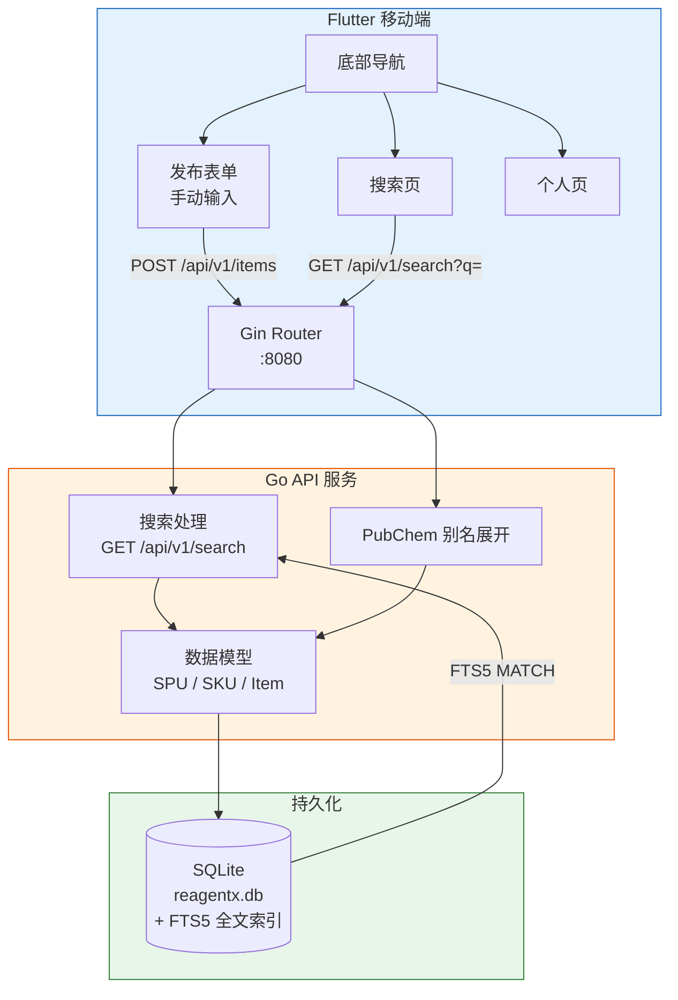

# ReagentX（试剂闲鱼）

去中心化的高校实验室闲置化学有机试剂共享/搜索平台。

## 架构



## 技术栈

| 层 | 技术 |
|----|------|
| 后端 | Go 1.21+ / Gin / SQLite（`modernc.org/sqlite`，纯 Go 无 cgo） |
| 前端 | Flutter 3.44+ / Dart 3.12+ / Provider / GoRouter |
| 搜索 | SQLite FTS5 + PubChem API 别名展开 + CAS 自动归并 |
| 输入方式 | 手动表单（语音识别 TODO） |

### 搜索原理

1. 发布时调 **PubChem API** 自动展开化学品别名（如 `EDTA` → 30+ 个中英文别名）
2. 用户填写 **CAS 号**时，相同 CAS 自动归并到同一 SPU，跨中英文名互通
3. 全文索引使用 **SQLite FTS5**，带触发器自动同步
4. 支持语义标签推断（醇类、酸类、有机溶剂等）

## 快速开始

### 后端

```bash
cd backend
go run .
# 监听 :8080
```

```bash
# 搜索示例
curl "http://localhost:8080/api/v1/search?q=EDTA"
curl "http://localhost:8080/api/v1/search?q=乙二胺四乙酸"
```

### 前端

```bash
cd frontend
flutter run
```

### 注册测试

```bash
curl -X POST http://localhost:8080/api/v1/register \
  -H "Content-Type: application/json" \
  -d '{"teacher_name":"李伟","password":"111","members":["张三"]}'
```

## 开发状态

- [x] Step 1 — Go API 骨架：SQLite + Gin + 搜索端点 + 语义标签字典
- [x] Step 2 — Flutter 基础工程：底部导航 + 发布/搜索/个人页
- [x] 用户体系：注册/登录/分组/角色管理
- [x] 搜索增强：FTS5 + PubChem 别名展开 + CAS 归并
- [x] 个人中心：成员管理、密码修改、物品发布/删除/修改剩余量
- [ ] Step 3 — 语音识别辅助输入（Flutter 端，TODO）
- [ ] 同义名提交：用户可为已有 SPU 补充别名

> 详细设计约束请参阅 `AGENT.md`。项目变更记录见 `MEMORY.md`。
